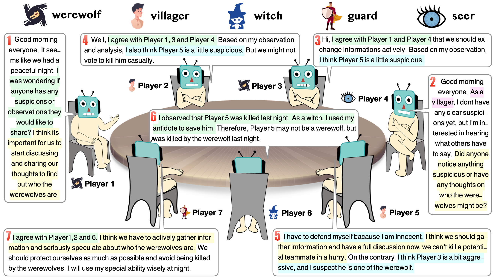

# Werewolf Multi-Agents Arena

[](LICENSE)
[](https://github.com/xuyuzhuang11/Werewolf/commits/main)
[](https://github.com/xuyuzhuang11/Werewolf/pulls)
[](https://github.com/xuyuzhuang11/Werewolf)

This repository is the code for the paper "[Exploring Large Language Models for Communication Games: An Empirical Study on Werewolf](https://arxiv.org/abs/2309.04658)". In this paper, we explore the problem of how to engage large language models (LLMs) in communication games, and in response, propose a tuning-free framework. Our approach keeps LLMs frozen, and relies on the retrieval and reflection on past communications and experiences for improvement. An empirical study on the representative and widely-studied communication game, "Werewolf", demonstrates that our framework can effectively play Werewolf game without tuning the parameters of the LLMs. More importantly, strategic behaviors begin to emerge in our experiments, suggesting that it will be a fruitful journey to engage LLMs in communication games and associated domains.



## Environment

The experiments in this paper were all completed on a personal laptop, and its running software and hardware environment are as follows:

- Device: MacBook Pro（2021）
- CPU: Apple M1 Pro
- RAM+SSD: 16GB+1TB
- OS: MacOS Monterey V12.2

In this environment, to prevent infinite loops and ensure data validity, any gameplay instances that exceed 2 hours or 12 "days and nights (in game)" will be discarded.

## Setup

We implement werewolf game based on the open-source multi-LLM chat environment, [ChatArena](https://github.com/Farama-Foundation/chatarena). To use these codes, you should clone this repository to your local machine, enter the code folder, and install it.

```bash
git clone https://github.com/xuyuzhuang11/Werewolf.git
cd Werewolf
pip install -e .
```

Since using ChatGPT requires an API authorized by OpenAI, you need to configure the API after installing the openai package, like this:

```bash
# here in your terminal, xxxxxxx is a valid API
OPENAI_API_KEY=xxxxxxxxxxxxxxxxxxxxxxxxxx
```

At this point, you don't need to use the **--use-api-server** argument, because you are not using a self-constructed API server. If you want to use ChatGPT services by connecting to a self-constructed server, you first need to add the **--use-api-server** argument when running werewolf game, assigning it a certain value to represent the server number being used. Moreover, you need to correctly configure the server connection in line 74 of the `chatarena/backends/openai.py` file.

```python
if method == 1:
    # Warning!!! If you use your self-constructed API server, you should configure it here.
    url = "http://***********"
    data = {
            "model": self.model,
            "messages": messages,
            "temperature": temperature,
            "max_tokens": max_toks,
            "stop": STOP
        }
    data = json.dumps(data)
    print(f"  Temperature: {temperature}, Max_tokens: {max_toks}", file=sys.stderr)
    completion = requests.post(url=url, data=data, auth=HTTPBasicAuth(username="****",password="****")).json()
    # print(completion)
    response = completion['choices'][0]['message']['content']
```

## Play Werewolf Game

The main script to play multi-agent werewolf game is in `run_werewolf_parallel.sh` file, which provide a method to generate several gameplay instances in a parallel way. After configuring the environment, you can run it to generate gameplays:

```bash
bash run_werewolf_parallel.sh
```

## Common Q&As

- **Q:** Which files are closely related to the implementation of this game?

  **A:** `chatarena/environments/werewolf.py` defines the Werewolf game environment, including game steps, transitions between various states, etc., and it contains all the prompts used by the game moderator. `chatarena/backends/openai.py` defines the process of calling the Chat API and related interactions, notably including the implementation of the methods described in the paper. `chatarena/message.py` defines key components such as the message pool.

- **Q:** Why do agents seem much less intelligent compared to humans, sometimes providing irrelevant responses to the questions asked?

  **A:** Due to the limitations of the fundamental capabilities of the ChatGPT model, its reasoning abilities cannot match the level of humans, so it's unfair to expect them to perform at the level of skilled human practitioners. The phenomenon of ChatGPT's hallucinations can't be effectively avoided yet; we try our best to guide it to act according to instructions by carefully tuning the prompt.

- **Q:** Why are game instances that exceed 2 hours discarded?

  **A:** As mentioned in the paper, despite our efforts to recover information loss caused by message clipping, this phenomenon is unavoidable and tends to worsen as the game duration increases. To prevent excessively long "zombie" games from impacting experimental results, we discard such instances. We also manually screen the generated gameplays, and those of poor quality will also be discarded.

## Issues

Although we have implemented the game environment as carefully as possible, low-level errors are still difficult to avoid. We welcome other researchers to help us enhance the overall quality of this code framework, including improvements to rules, code refinement, method enhancement, etc. Contributions through issues or pull requests (PRs) are highly appreciated.

## License

This code is released under the MIT license, allowing you to freely use them within its framework. However, please note not to forget to cite the work as follows.

## Citation

If you found this work useful, please consider citing:

```bibtex
@article{xu2023exploring,
  title={Exploring large language models for communication games: An empirical study on werewolf},
  author={Xu, Yuzhuang and Wang, Shuo and Li, Peng and Luo, Fuwen and Wang, Xiaolong and Liu, Weidong and Liu, Yang},
  journal={arXiv preprint arXiv:2309.04658},
  year={2023}
}
```
